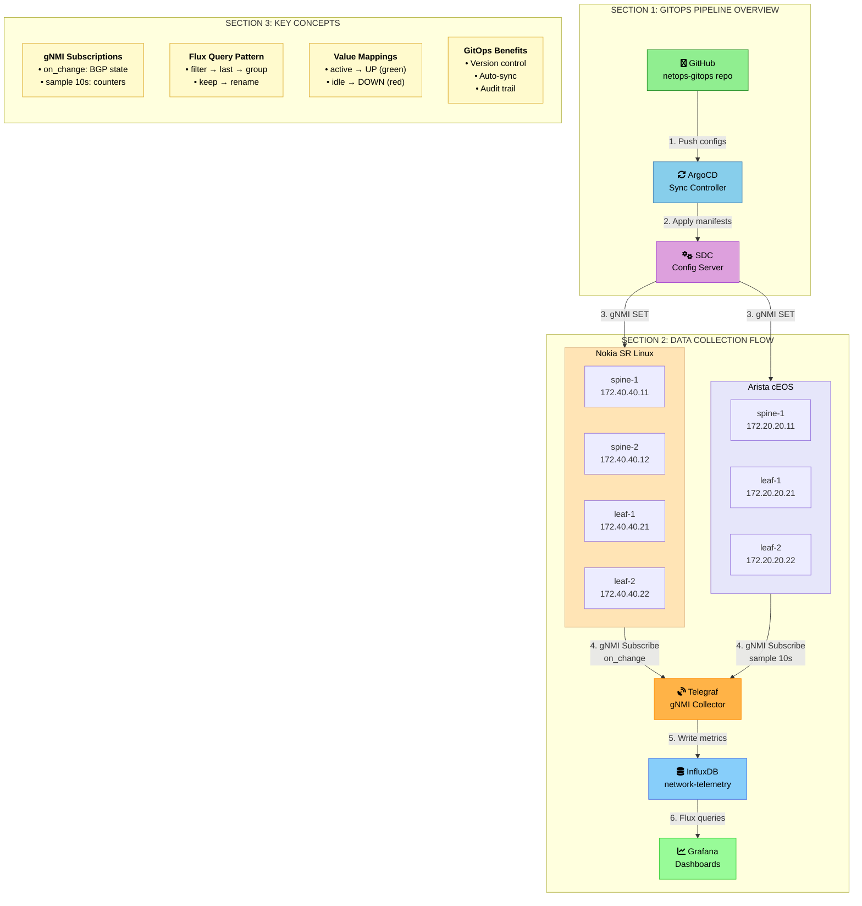
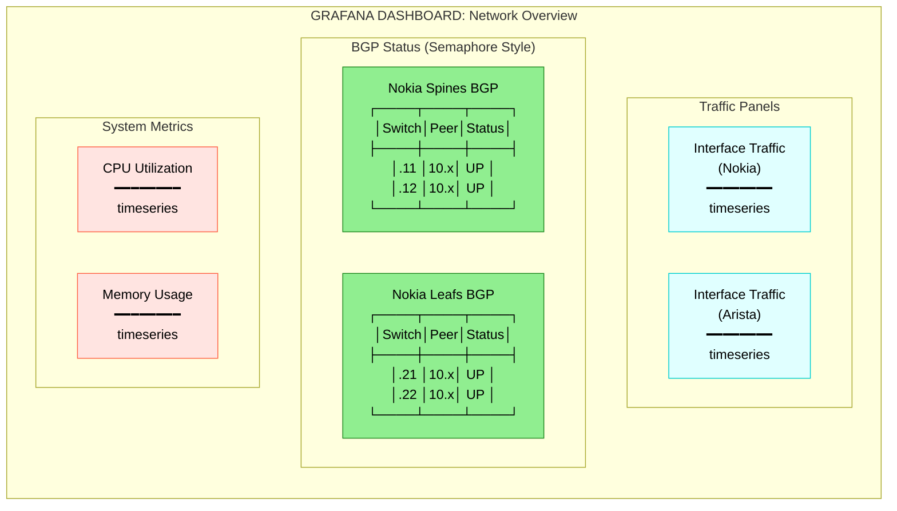
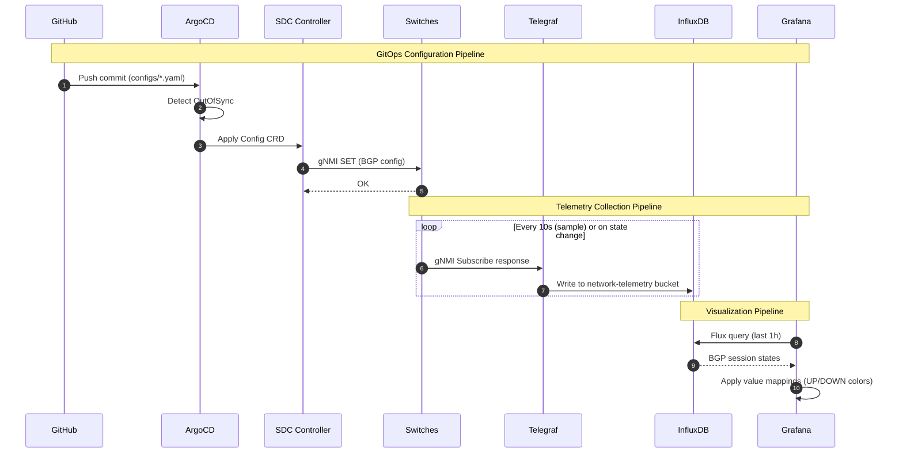

# NetOps GitOps BGP Monitoring - Whiteboard Diagram

> Diagrama estilo whiteboard educacional do pipeline GitOps para monitoramento BGP

## Diagrama Principal



## BGP Status Dashboard Layout



## Data Flow Detail



## Legend

| Symbol | Meaning |
|--------|---------|
| Green boxes | Input/Source components |
| Blue boxes | Processing components |
| Orange boxes | Collection components |
| Purple boxes | Controller components |
| Yellow boxes | Key concepts/notes |

## Technical Details

### Flux Query (BGP Status)

```flux
from(bucket: "network-telemetry")
  |> range(start: -1h)
  |> filter(fn: (r) => r["_measurement"] == "bgp_neighbor")
  |> filter(fn: (r) => r["_field"] == "session_state")
  |> last()
  |> group()                    // Merge separate tables
  |> keep(columns: ["source", "peer_address", "_value"])
  |> rename(columns: {
      source: "Switch",
      peer_address: "Peer",
      _value: "Status"
  })
```

### Value Mappings (Grafana)

| State | Display | Color |
|-------|---------|-------|
| established | UP | Green |
| active | UP | Green |
| idle | DOWN | Red |
| connect | CONNECTING | Yellow |

### gNMI Subscriptions (Telegraf)

| Target | Path | Mode |
|--------|------|------|
| Nokia | `/network-instance[name=default]/protocols/bgp/neighbor[peer-address=*]/session-state` | on_change |
| Nokia | `/interface[name=*]/statistics` | sample 10s |
| Arista | `/interfaces/interface/state/counters` | sample 10s |

---

*Generated: 2026-01-15 | Style: Whiteboard Educational*
